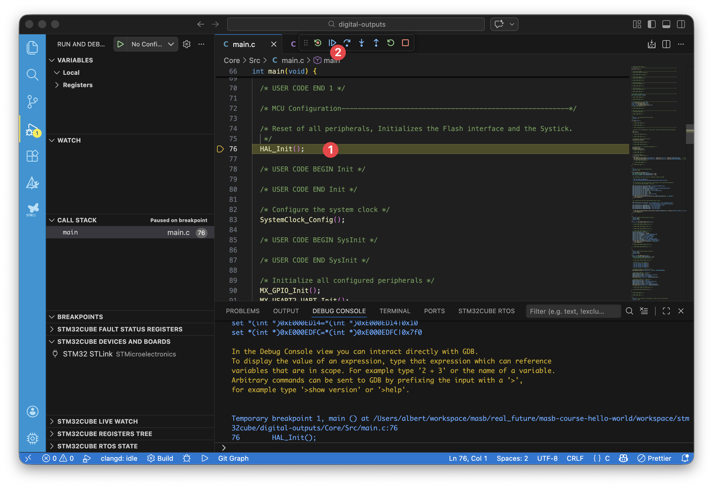

# Hello, World!

</br>

In this second part of the first practice, you will learn how to achieve the same functionality as in the first part, but by programming at the register level. Register-level programming means working directly with the microcontroller's hardware, configuring and controlling it manually. While Arduino simplifies this process by handling many details behind the scenes, register-level programming gives you full control and is essential for professional and industrial applications.

Although Arduino is convenient and easy to use, it is rarely used in industrial or professional environments. The main reasons are:

1. [Arduino is licensed under LGPL](https://github.com/arduino/Arduino/blob/master/license.txt), which requires you to make object files publicly available and can expose your code to reverse engineering. This makes it difficult to protect your intellectual property.
2. Arduino is designed to work on many microcontrollers, so it is not optimized for any specific one. In industry, resource optimization is crucial.
3. Arduino does not comply with certain regulations, such as those required for medical devices.

Arduino is excellent for prototyping because it allows you to quickly test ideas and functionality. In professional development, it is common to start with Arduino for rapid prototyping, then migrate to register-level programming for the final product, where optimization and compliance are required.

In this practice, you will work with digital inputs and outputs at the register level using STM32Cube for VS Code. To do this, we use the **[HAL (Hardware Abstraction Layer)](https://en.wikipedia.org/wiki/Hardware_abstraction_layer)** libraries provided by STMicroelectronics.

HAL libraries provide a bridge between your software and the microcontroller's hardware. They offer a higher level of abstraction, making your code easier to migrate to other microcontrollers and simplifying development. At the same time, HAL allows you to access low-level hardware features when you need to optimize your application.


> Image from [STMicroelectronics](https://www.st.com/content/ccc/resource/sales_and_marketing/presentation/product_presentation/37/55/ff/bc/a8/71/4f/c5/stm32_embedded_software_offering.pdf/files/stm32_embedded_software_offering.pdf/jcr:content/translations/en.stm32_embedded_software_offering.pdf).

**Not all companies offer HAL libraries**. Whether they provide them or not **is another criterion** to consider when **choosing** to develop our product with a microcontroller from one company or another, as it directly impacts development time (_time-to-market_) and, consequently, its cost. For this reason, **leading development companies usually offer HAL**. Each company's HAL is different, so as developers, we will need to learn the HAL of the relevant microcontroller. However, once we have learned to use one HAL, switching to another company's HAL won't require much effort, as they usually follow a similar implementation philosophy.

> [!NOTE]
> If we don't want to use HALs, we can always go full hardcore and write code at the lowest level (and thus become the typical person on Internet forums loudly proclaiming that they don't use HAL...), but this is not the most common approach for **most** developments. However, there are specific cases that require extreme resource optimization, making it necessary to implement our own HAL. But again, these are **very specific cases**.

Now, let's turn on that LED!

## Objectives

- Understand STM32Cube for VS Code and how it works.
- Generate code using the STM32CubeMX tool.
- Learn the basic structure of `main.c` and its proper usage.
- Use GPIOs for both input and output.
- Create, compile, and upload the first C/C++ program at the register level.
- Learn new C and Git functionalities and commands.

## Procedure

### Create a development branch

Let's start by ensuring we are on the `main` branch and that it is up to date with the latest changes from the remote repository. To switch to the `main` branch, we run the following command:

```bash
git switch main
```

We check that the terminal indicates we are on the `main` branch. If we are unable to switch, it is likely due to having uncommitted changes. In that case, we make the necessary commit and then switch branches.

Once we are on the `main` branch, to import any changes made in the remote repository, we execute the following command:

```bash
git pull
```

This command performs the inverse operation of the `git push` command. While `git push` uploads changes to the remote repository, the `git pull` command imports them. The terminal will indicate whether there are any new changes that have been incorporated into our local repository.

With everything properly synchronized, let's create our development branch for this practice:

```bash
git switch -c {{ digital_outputs_branch_name }}
```

We ensure that we have successfully switched branches and can now begin development.

### IDE Preparation

#### Installing STM32Cube for VS Code

The installation is straightforward and similar to that of PlatformIO IDE. Go to the following [link](https://www.st.com/content/st_com/en/stm32-mcu-developer-zone/software-development-tools/stm32cubevscode.html#) and from there launch the installation of the extension for VS Code. The manufacturer itself recommends installing it in a separate VS Code profile to avoid extension incompatibilities.

> [!NOTE]
> Or, as in the previous exercise, you can import the profile I have prepared with all the necessary extensions already selected. Also, as with the MASB Arduino profile, the activity bar color has been customized to make it clear that you are in the MASB STM32Cube profile. You can find the profile [here](https://vscode.dev/profile/github/5b4ade0f4e209cb2aeab2046c9a627b4).

The VS Code extension uses the STM32CubeMX tool to generate code. This is not included in the installation and is required. Go to the following [link](https://www.st.com/en/development-tools/stm32cubemx.html#st-get-software) and download the version corresponding to your operating system. The tool is free, but you need to create an account. Once downloaded, install it by following the classic "Next", "Next", "Next" steps, and it will be installed.

Once everything is installed, when you open VS Code and select the profile MASB STM32Cube for STM32Cube development for the first time, a couple of tools will finish installing and the application will ask you to restart. Do so, and everything will be ready.

#### Creating a Project

To create a project, first open STM32CubeMX, our code generator. You can either open it directly as a regular application or launch it from VS Code using the STM32Cube extension by clicking on "Launch STM32CubeMX".


Once open, select the option to create a project for an ST board.


A selector will open. In it, select your board NUCLEO-F401RE. You can add it to favorites to find it easily for future projects.


When creating the project, it will ask if you want to initialize the peripherals by default. The answer is **Yes**. If you don't, some peripherals, like the debugger, won't work.


Once the project is created, the graphical project configurator will open. We'll return to it later to configure the output pins, but for now, just set the project information, such as the name and location. To do this, go to the "Project Manager" tab, enter the project name as `{{ digital_outputs_project_name }}`, set the project location to the folder `{{ stm32cube_folder_name }}` (create it if it doesn't exist), and select `CMake` as the Toolchain.

Click "Generate code" and you're done.


It will ask if you want to open the folder created for the project. Say no, as you'll open it from VS Code.


You can now close STM32CubeMX. Now go to VS Code and open the newly created folder (`{{ stm32cube_folder_name }}/{{ digital_outputs_project_name }}`). When you open it, a popup will appear asking if you want to configure the detected project (if it doesn't appear, make sure you have the MASB STM32Cube profile active in VS Code). Click yes.


A series of files will be automatically configured and you can start working. For example, you can open the main file located at `Core/Src/main.c`.


Finally, let's build the program to check that everything works correctly. You can do this either from the status bar:


Or from the CMake extension.


If the terminal shows 0 errors, you can celebrate having created a project for STM32Cube! 🎉

### Hey, hello again, World

#### Configuring the LED-connected pin

At this point, the project and all its basic files have been created. Next, reopen the graphical configuration tool for the microcontroller: STM32CubeMX. Instead of creating a new project, select "File > Load project" to open the existing one. Choose the folder where you created the project, and STM32CubeMX will load it for you.


In the STM32CubeMX window, an interactive image of the microcontroller and all its pins appears. Through this interactive image, we can configure the function of each pin individually (something we couldn't do with standard Arduino).

> [!NOTE]
> ["Vanilla"](https://en.wikipedia.org/wiki/Vanilla_software) is a term used to refer to using an element without modifications. "Arduino Vanilla" means "Arduino just as it comes out of the box."

Let's configure the pin connected to the LED. By default, it is already set up because we selected the correct evaluation board (EVB) when creating the project, but we will repeat the process to understand how it works.

To select the function for a pin, left-click on the pin and choose the desired function from the available options. For example, left-click on pin `PA5` and select `GPIO_Output`. If it was already configured, clicking again will reset it. Select `GPIO_Output` once more to confirm.

Next, assign an alias or _label_ to the pin to make your code more readable. Right-click on pin `PA5`, select `Enter User Label`, and type `LED` in the pop-up text box.

Click on `System view`, located just above the interactive image, to see the currently configured peripherals. Among the pre-configured peripherals, you will find `GPIO`. Click on it to access a detailed view of the GPIO configuration. Here, two pins are configured—one is the LED you just set up, and the other is the push button. Select the row for the LED pin to view and adjust its settings: default output, output type, pull-up/down, pin speed, and alias. For this exercise, you only need to ensure the default output level is set so the LED is off by default.

Once the microcontroller is correctly configured, click `File > Save`, and then click "Generate code".

You may leave STM32CubeMX open for convenience.

#### The _main_ file

When you generate code, STM32CubeMX creates several files in the project and updates the `main.c` file. **This file contains the `main` function, which is executed by the microcontroller**. In VS Code, open the `main.c` file and scroll through it. Most of the content—and many lines across other files—are generated automatically by STM32CubeMX. This automation saves time and helps maintain structure. Let's examine the structure of the `main.c` file.

When using HAL, pay close attention to the comments in the code. These comments indicate where you are allowed to add your own code. If you add code outside these regions, STM32CubeMX may delete it when regenerating code after configuration changes.

**You should only write code between comments that start with `USER CODE BEGIN` and `USER CODE END`.**

```c
/* USER CODE BEGIN Header */
--> WE CAN ADD CODE HERE
/**
  ******************************************************************************
  * @file           : main.c
  * @brief          : Main program body
  ******************************************************************************
  * @attention
  *
  * Copyright (c) 2026 STMicroelectronics.
  * All rights reserved.
  *
  * This software is licensed under terms that can be found in the LICENSE file
  * in the root directory of this software component.
  * If no LICENSE file comes with this software, it is provided AS-IS.
  *
  ******************************************************************************
  */
/* USER CODE END Header */
/* Includes ------------------------------------------------------------------*/
#include "main.h"

/* Private includes ----------------------------------------------------------*/
/* USER CODE BEGIN Includes */
--> WE CAN ADD CODE HERE
/* USER CODE END Includes */

/* Private typedef -----------------------------------------------------------*/
/* USER CODE BEGIN PTD */
--> WE CAN ADD CODE HERE
/* USER CODE END PTD */

...
```

Now that you know about the comments and that you cannot add code wherever you want, let's move on to see what the `main.c` file contains, ignoring everything that is commented.

The first instruction is:

```c
...

/* Includes ------------------------------------------------------------------*/
#include "main.h"

...
```

This instruction, and **all those starting with a hash `#`**, is not executed by the microcontroller, but rather **it is an instruction for the [preprocessor](https://en.wikipedia.org/wiki/Preprocessor)**. The `include` instruction tells the preprocessor to, as its name suggests, include the specified file before performing the program's [compilation](https://en.wikipedia.org/wiki/Compileriki/Compilador). In this case, the included file is `main.h`, a file with a `.h` extension called a [`header`](https://www.tutorialspoint.com/cprogramming/c_header_files.htm). This type of file contains the definition of constants, macros, global variables, function prototypes, etc. At the moment, we don’t know what all these elements are. Little by little, we'll see them. To view the content of this `main.h`, we can open `Core > Inc > main.h`. If we don't know the file's location (which is quite common!), we can click over the file name in the `#include` instruction while holding <kbd>CTRL</kbd> (or <kbd>⌘</kbd> on macOS). This will directly open the `main.h` file.

> **The <kbd>CTRL</kbd> or <kbd>⌘</kbd> + click shortcut is super useful!** When you're not sure where a file, function, or variable comes from, click it while holding <kbd>CTRL</kbd> or <kbd>⌘</kbd> to show its origin.

The following code is:

```c
...

/* Private variables ---------------------------------------------------------*/
UART_HandleTypeDef huart2;

...
```

This instruction declares a global variable named `huart2`. Being global, this variable can be used from any function within the file where it has been declared. Remember, a variable is global when it is not declared inside any function.

It is of type `UART_HandleTypeDef`, a non-standard variable type defined using the keyword [`typedef`](https://en.wikipedia.org/wiki/Typedef). The `typedef` keyword is used to assign an alternate name to an existing variable type to make the code more readable.

Next, in `main.c`, we find:

```c
...

/* Private function prototypes -----------------------------------------------*/
void SystemClock_Config(void);
static void MX_GPIO_Init(void);
static void MX_USART2_UART_Init(void);

...
```

In this section of the code, the [prototypes](https://www.tutorialspoint.com/importance-of-function-prototype-in-c) of three different functions are specified. Prototyping a function serves to inform the compiler about which functions exist, what type of value they return (if any), and what type of parameters they take (if any). These three functions are used within the `main` function, and their code appears after this.

Right after the prototypes, the `main` function appears, the function that the microcontroller will execute.

```c
...

/**
  * @brief  The application entry point.
  * @retval int
  */
int main(void)
{
  HAL_Init();
  SystemClock_Config();
  MX_GPIO_Init();
  MX_USART2_UART_Init();

  while (1)
  {

  }

}

...
```

The `main` function is designed to be highly readable, which is always our goal in code development. Even without knowing the details, the function names make it clear: first, the HAL libraries are initialized; then, the system clock is configured; next, the GPIO peripheral is initialized; after that, the UART communication peripheral is initialized; and finally, the program enters the _while loop_. The first four instructions run only once at the start of the program (similar to the `setup` function in Arduino). The code inside the _while loop_ runs continuously (similar to the `loop` function in Arduino).

Finally, STM32CubeMX generates several functions that handle tasks such as initializing the clock system, GPIO, and UART. You do not need to understand their details yet; focus on how they fit into the overall structure.

```C
...

/**
  * @brief System Clock Configuration
  * @retval None
  */
void SystemClock_Config(void)
{

...

}

/**
  * @brief USART2 Initialization Function
  * @param None
  * @retval None
  */
static void MX_USART2_UART_Init(void)
{

...

}

/**
  * @brief GPIO Initialization Function
  * @param None
  * @retval None
  */
static void MX_GPIO_Init(void)
{

...

}

/**
  * @brief  This function is executed in case of error occurrence.
  * @retval None
  */
void Error_Handler(void)
{

}

#ifdef  USE_FULL_ASSERT
/**
  * @brief  Reports the name of the source file and the source line number
  *         where the assert_param error has occurred.
  * @param  file: pointer to the source file name
  * @param  line: assert_param error line source number
  * @retval None
  */
void assert_failed(uint8_t *file, uint32_t line)
{

}
#endif /* USE_FULL_ASSERT */
```

#### "Oh my God... I just want to make the LED blink!"

Okay, okay. Let's do it. To make the LED blink, we only need to add the instruction to turn it on and off. There's no need to configure/initialize anything as STM32CubeMX has already done that for us.

Since this is something we want to run continuously, we will add it inside the _while loop_. Where exactly? Where I indicate in the following code (**do not add this to your `main.c`**):

```c
...

  /* Infinite loop */
  /* USER CODE BEGIN WHILE */
  while (1)
  {
    YOU CAN PUT CODE HERE
    /* USER CODE END WHILE */

    DONT EVEN THINK ABOUT PUTTING ANYTHING HERE!

    /* USER CODE BEGIN 3 */
    YOU CAN PUT CODE HERE
  }
  /* USER CODE END 3 */

...
```

Clear as water. **If you put code where it doesn't belong, STM32CubeMX will delete it when regenerating the code.**

And what functions are there to make the output of the pin connected to the LED `PA5` be `0` or `1`? Here, the documentation provided by the owner of the HAL is of utmost importance. STMicroelectronics provides a user guide with all the available instructions in the HAL. You can find this document [here](https://www.st.com/content/ccc/resource/technical/document/user_manual/2f/71/ba/b8/75/54/47/cf/DM00105879.pdf/files/DM00105879.pdf/jcr:content/translations/en.DM00105879.pdf). **Keep this document like gold and always have it at hand!**

In the documentation, among a large number of functions, we find the following function within the GPIOs: `HAL_GPIO_WritePin`. This is the instruction we need to use to set the output value of a GPIO pin.

> **It is extremely important that you know how to navigate the documentation**. For that reason, I recommend looking up all the functions we use in the [HAL user guide](https://www.st.com/content/ccc/resource/technical/document/user_manual/2f/71/ba/b8/75/54/47/cf/DM00105879.pdf/files/DM00105879.pdf/jcr:content/translations/en.DM00105879.pdf). There, you'll find their purpose and usage.

So, let's make the LED turn off and on by adding the `HAL_GPIO_WritePin` function inside the _while loop_.

```c
...

/* Infinite loop */
  /* USER CODE BEGIN WHILE */
  while (1) {
    HAL_GPIO_WritePin(LED_GPIO_Port, LED_Pin, GPIO_PIN_SET);   // turn on LED
    HAL_GPIO_WritePin(LED_GPIO_Port, LED_Pin, GPIO_PIN_RESET); // turn off LED
    /* USER CODE END WHILE */

    /* USER CODE BEGIN 3 */
  }
  /* USER CODE END 3 */

...
```

The function `HAL_GPIO_WritePin` requires three parameters: the port of the pin, the pin number, and the desired output state. The LED pin is `PA5`, which corresponds to port `A` (`GPIOA`) and pin 5 (`GPIO_PIN_5`). And we want it to be high (`GPIO_PIN_SET`) and low (`GPIO_PIN_RESET`). All this information can be found in the [HAL document](http://bit.ly/2UvNqwb).

Since we have labeled the LED pin in STM32CubeMX, we can use the macros `LED_GPIO_Port` and `LED_Pin`, making the code more readable.

> [!NOTE]
> _"You've mentioned macros several times. What is that?"_ A macro is generated from a preprocessor instruction (remember, instructions that start with the hash `#`). This instruction is `#define`. With this instruction, we tell the preprocessor to replace a given macro with specific code before compiling. For example, the macro `LED_Pin` is defined:
>
> ```c
> #define LED_Pin				GPIO_PIN_5
> ```
>
> So every time we use `LED_Pin`, it will be replaced by `GPIO_PIN_5` before compiling the program. In turn, `GPIO_PIN_5` is another macro:
>
> ```c
> #define GPIO_PIN_5    ((uint16_t)0x0020)  /* Pin 5 selected    */
> ```
>
> The <kbd>CTRL</kbd> or <kbd>⌘</kbd> + click shortcut also applies to macros, so you can always see the definition of a macro.
>
> Macros are very useful for making the code more readable and for quickly modifying a program in response to a design change. For example, if we use the `LED_Pin` macro throughout the code and the LED moves from pin `5` to pin `2`, we can change the definition of the `LED_Pin` macro:
>
> ```c
> #define LED_Pin				GPIO_PIN_2
> ```
>
> and all our code is automatically updated. If we had used `GPIO_PIN_5` directly, we would have to go through the code one by one and replace each `GPIO_PIN_5` with `GPIO_PIN_2`.
>
> Lastly, it is usually an unwritten rule to write macros in all uppercase letters to make them easily identifiable.

Perfect, let's compile the project. Then, let's load the program onto the microcontroller. To do this, make sure the EVB is connected to the computer and then go to the Debug tab and click on Run and debug. In the selector that appears, choose the option "STM32Cube: STLink GDB Server".


It is very likely that you will get an error when loading.


If so, check if the following message appears in the terminal:


If that's the case, you simply need to update the debugger firmware, which receives periodic updates from the manufacturer. To do this, just go to the Debug tab and then to the dropdown "STM32CUBE DEVICES AND BOARDS." There, your debugger should appear. Click the icon to upgrade.


When the update process finishes, STM32Cube will notify you.


Start the debug process again and now you should be able to begin. The cursor will be placed on the first instruction within the `main` function.



**The execution of our program is paused just before the highlighted instruction is executed**. To start the execution, we click Play icon.

As we saw in the first part of the practice in Arduino, the LED does not blink. The _delays_ are missing. Stop the program's debugging by clicking the stop icon, and then add the _delays_.

**In the HAL documentation, we search for how to implement a _delay_**. We will find that our function is `HAL_Delay()`, where the time is given in milliseconds. Let's add the instruction to the code.

```c
...

/* Infinite loop */
  /* USER CODE BEGIN WHILE */
  while (1) {
    HAL_GPIO_WritePin(LED_GPIO_Port, LED_Pin, GPIO_PIN_SET);   // turn on LED
    HAL_Delay(1000);                                           // delay 1 second
    HAL_GPIO_WritePin(LED_GPIO_Port, LED_Pin, GPIO_PIN_RESET); // turn off LED
    HAL_Delay(1000);                                           // delay 1 second
    /* USER CODE END WHILE */

    /* USER CODE BEGIN 3 */
  }
  /* USER CODE END 3 */

...
```

We test the program, and this time, the LED blinks every 1 second. Stop the debugging and save this version of the code.

Since many new files were created when we made a new project, adding each file one by one would be tedious. Therefore, we will use the Git instruction to add files to the _stage_ as we already know, but instead of specifying the names of the files or folders, we will make it add all the new, edited, or deleted files:

```bash
git add -A
```

"Wow... You should have taught me that from the start..." No. In this case, it is appropriate to add all the files at once because we initialized a new project and many files were created in a single action, but the recommended practice is to make _commits_ where only a few files are modified and add them manually to the _stage_ as we have done so far.

We make the _commit_, and if we want, a _push_ to upload the changes to the remote repository.

```bash
git commit -m "LED blinking every 1 second"
git push
```

Remember that, since we created a new branch, the `push` command will give us an error and indicate the command we should use. **Copy that command and execute it**. Once the new branch has been uploaded to the remote repository, you can execute the `push` command normally.

Finally, create the Pull Request from your branch to the `main` branch to launch the tests. If any test fails, apply the necessary corrections. Once all tests pass, you can merge the Pull Request without deleting the branch afterwards.

### Digital Inputs

Now, let's try to turn the LED on and off using the B1 button. Before that, go to the `main` branch, pull potential changes from the remote repository, and create and checkout a new branch named `{{ digital_inputs_branch_name }}`. Create a new STM32Cube project in `{{ stm32cube_folder_name }}` named `{{ digital_inputs_project_name }}` and configure the LED pin. Now, let's configure the B1 button. To do this, we need to configure pin `PC13`. Go to STM32CubeMX. In the interactive image, configure pin `PC13` as `GPIO_Input` and label it as `PUSH_BUTTON`. Once done, regenerate the code.

In `main.c`, it seems nothing has been modified, but actually, there is a modification. For example, the function `MX_GPIO_Init` now initializes pin `PC13` as `PUSH_BUTTON`, which it didn't before.

Now, let's make it so that depending on the state of the button, the LED alternates between on and off. According to the HAL documentation, our function is `HAL_GPIO_ReadPin`, and the code will look as follows.

```c
...

  /* Infinite loop */
  /* USER CODE BEGIN WHILE */
  while (1) {
    if (HAL_GPIO_ReadPin(PUSH_BUTTON_GPIO_Port, PUSH_BUTTON_Pin) ==
        GPIO_PIN_RESET) { // if B1 pushed
      if (HAL_GPIO_ReadPin(LED_GPIO_Port, LED_Pin) ==
          GPIO_PIN_RESET) {                                      // if LED off
        HAL_GPIO_WritePin(LED_GPIO_Port, LED_Pin, GPIO_PIN_SET); // turn it on
      } else {                                                   // if not
        HAL_GPIO_WritePin(LED_GPIO_Port, LED_Pin,
                          GPIO_PIN_RESET); // turn if off
      }
    }
    /* USER CODE END WHILE */

    /* USER CODE BEGIN 3 */
  }
  /* USER CODE END 3 */

...
```

We can refactor the code using a function available in the HAL: `HAL_GPIO_TogglePin`.

> [!NOTE]
> [Refactoring](https://en.wikipedia.org/wiki/Refactoring) code means improving it by rewriting the same functionality with the goal of enhancing its efficiency, readability, level of abstraction, etc.

In this way, the code would look like:

```c
...

  /* Infinite loop */
  /* USER CODE BEGIN WHILE */
  while (1) {
    if (HAL_GPIO_ReadPin(PUSH_BUTTON_GPIO_Port, PUSH_BUTTON_Pin) ==
        GPIO_PIN_RESET) {                         // if B1 pushed
      HAL_GPIO_TogglePin(LED_GPIO_Port, LED_Pin); // toggle state
    }
    /* USER CODE END WHILE */

    /* USER CODE BEGIN 3 */
  }
  /* USER CODE END 3 */

...
```

We build and run the program, and as we could already guess, it doesn't quite work properly because the button is being read as _level triggered_. Let's make it _edge triggered_ using a boolean variable.

If we look in the comments of `main.c`, we will see that STM32CubeMX indicates that global variables should be added in the following position:

```c
...

/* USER CODE BEGIN PV */

/* USER CODE END PV */

...
```

We can use the search function to find these comments. There, we add our global boolean variable.

```c
...

/* USER CODE BEGIN PV */
bool highToLowTransition = false;
/* USER CODE END PV */

...
```

Before continuing, let's build the program ...

Build failed! 💣💥 The IDE indicates an error. You can see them directly in the Output window at the bottom of the IDE, or from the Problems window located in the same place. The compiler complains that the `bool` variable type doesn't exist, nor does the `false` keyword. In this development environment, `bool` variables don't exist by default.

> [!IMPORTANT]
> It is **very important to get used to reading the information provided by the compiler in the console**, as it gives us a lot of details about the error to fix it, as well as possible solutions, as in this case.

The second error tells us that `false` does not exist. **The logic in a microcontroller is that a value of 0 will always be `false`, while anything different from 0 will be `true` (the same applies in Arduino)**. Therefore, if `true`/`false` doesn't exist, we can use `0` and `1` (or any value other than 0), or we can include the stdbool library, as suggested by the IDE.

```c
#include <stdbool.h>
```

The last option is the most suitable. Let's incorporate the include wherever STM32CubeMX comments suggest.

```c
...

/* Private includes ----------------------------------------------------------*/
/* USER CODE BEGIN Includes */
#include <stdbool.h>
/* USER CODE END Includes */


...
```

And now, we build and—no problem, my friend! 😎

> [!NOTE]
> It is a very good practice, **highly recommended**, to build the code from time to time as you develop in order to detect errors as soon as possible. If you develop for a long time without building, errors will be harder to trace.

Now in the `main` function, we have just developed the code:

```c
...

  /* Infinite loop */
  /* USER CODE BEGIN WHILE */
  while (1) {
    if (HAL_GPIO_ReadPin(PUSH_BUTTON_GPIO_Port, PUSH_BUTTON_Pin) ==
        GPIO_PIN_RESET) {                           // if B1 pushed
      if (highToLowTransition == false) {           // if not pushed before
        highToLowTransition = true;                 // save that we have pushed
        HAL_GPIO_TogglePin(LED_GPIO_Port, LED_Pin); // toggle LED state
      }
    } else {                       // if B1 not pushed
      highToLowTransition = false; // reset variable value
    }
    /* USER CODE END WHILE */

    /* USER CODE BEGIN 3 */
  }
  /* USER CODE END 3 */

...
```

We build/debug and now, everything works correctly. We stop the debugging and save this version of the code.

```bash
git add -A
git commit -m "we toggle the LED state with the B1 button"
git push
```

Once again, we use `git add -A` because we've modified many files by regenerating the code with STM32CubeMX. Otherwise, we would have done:

```bash
 git add {{ stm32cube_folder_name }}/{{ digital_inputs_project_name }}/Core/Src/main.c
```

**Remember that you can always see which files have been created, modified, or deleted with the `git status` command.**

Don't forget to make the corresponding Pull Request from the `{{ digital_inputs_branch_name }}` branch to `main`. You already know what to do for the rest.

## Challenge

Can you guess what it is? Yes. The same as with Arduino: use the push button B1 to toggle the LED between being off and blinking every 500 ms. Complete the challenge, and once you have it, make the corresponding _commit_ and _push_. To do this, from the `main` branch create and checkout a new branch named `{{ challenge_branch_name }}` and create a new project, as you already know, named `{{ challenge_project_name }}`. Create the corresponding Pull Request to `main` when you have finished the challenge.

## Evaluation

### Deliverables

These are the elements that must be available for the evaluation:

- [ ] **Commits**
      Your remote GitHub repository must contain at least the following required commits made during the practice: LED blinking, LED turning on and off with the button, and challenge solution.

- [ ] **Challenge**
      The challenge must be solved and included with its corresponding commit.

- [ ] **Pull Requests**
      The different Pull Requests requested throughout the practice must also be present in your repository.

### Rubric

You can find the evaluation rubric on the CampusVirtual. We recommend you take a look at it so you know exactly what will be evaluated and what is expected.

## Conclusions

With this second part, we have finished the first practice of MASB, where we have learned how to work with GPIOs of a microcontroller at the register level using the HAL.

In Git, we saw how to switch between branches and synchronize the local repository to incorporate modifications made in the remote repository. We also learned how to add several files at once to the _stage_.

We learned how to create a project in STM32CubeIDE and how to configure it graphically with STM32CubeMX. We also took a look at the structure of the `main.c` file in the project and where to insert our code.

Finally, we learned other aspects of C programming, such as using macros or `typedef`.
